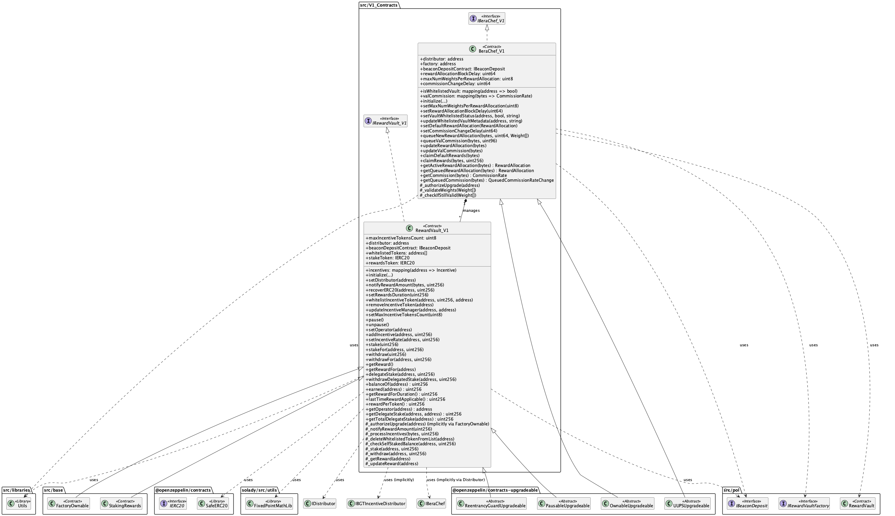
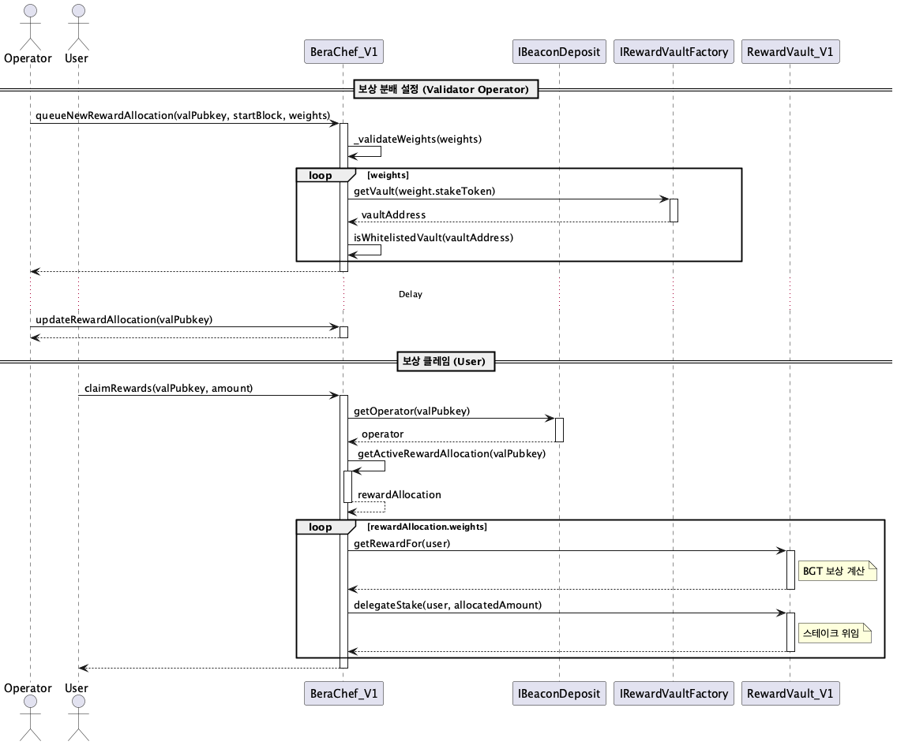
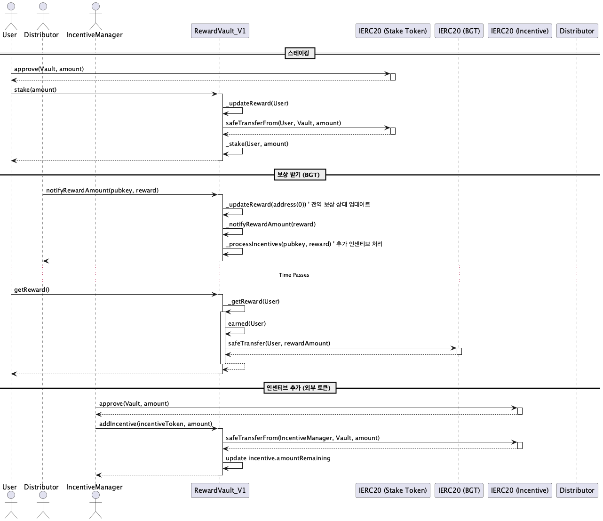

# src/V1_Contracts

이 모듈은 Berachain의 초기 버전(V1) 보상 시스템 관련 핵심 컨트랙트들을 포함합니다.

## Contracts Overview

*   **BeraChef_V1:** 검증자별 보상 분배 비율 및 화이트리스트된 리워드 볼트(`RewardVault_V1`)를 관리합니다. 검증자는 자신의 보상 분배 설정을 커스터마이징할 수 있습니다.
*   **RewardVault_V1:** 특정 스테이킹 토큰에 대한 BGT 보상 및 추가 인센티브 토큰의 스테이킹과 분배를 담당하는 볼트 컨트랙트입니다. 사용자는 이 컨트랙트에 스테이킹 토큰을 예치하여 BGT 및 인센티브 보상을 받을 수 있습니다.

## BeraChef_V1 Sequence

아래 다이어그램은 `BeraChef_V1`을 통해 검증자가 보상 분배 설정을 업데이트하고, 사용자가 해당 검증자에 대한 보상을 클레임하는 과정을 보여줍니다.

## RewardVault_V1 Sequence

이 다이어그램은 사용자가 `RewardVault_V1`에 스테이킹 토큰을 예치하고, BGT 보상을 받으며, 외부 인센티브가 추가되는 과정을 보여줍니다.

 