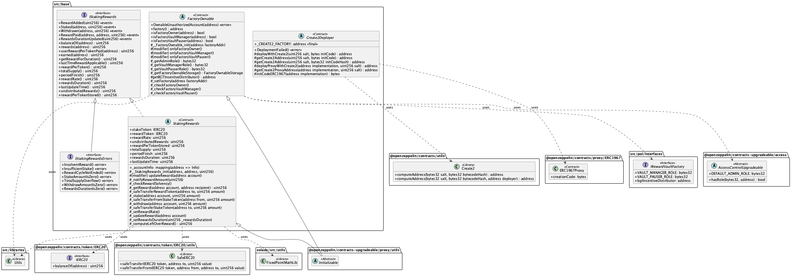
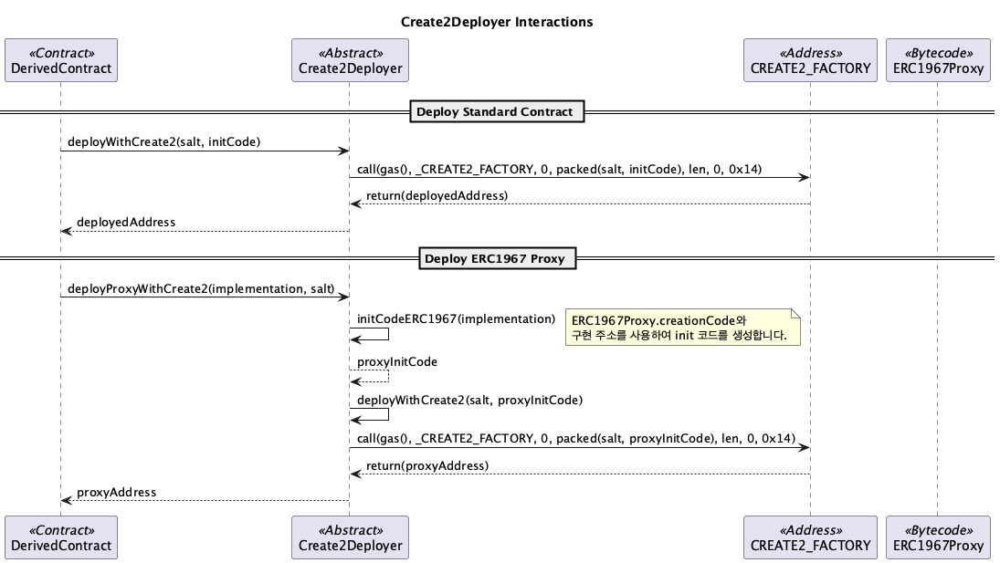
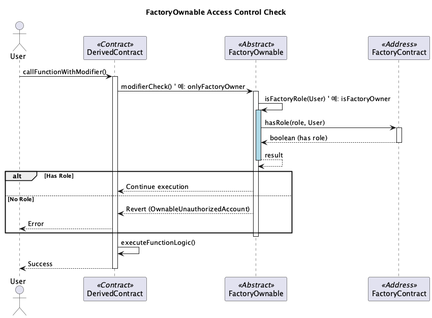
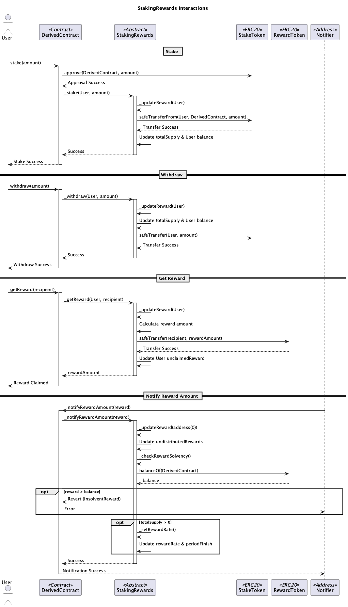

# src/base

이 모듈은 Berachain 시스템의 다른 컨트랙트들이 상속받아 사용하는 기본(Base) 컨트랙트 및 인터페이스를 포함합니다.

## Contracts Overview

*   **Create2Deployer:** OpenZeppelin의 `Create2` 라이브러리를 사용하여 결정론적 주소(Deterministic Address)에 컨트랙트 및 ERC1967 프록시를 배포하는 기능을 제공하는 추상 컨트랙트입니다. 여러 Deployer 컨트랙트(`GovDeployer`, `POLDeployer`, `BGTFeeDeployer`, `HoneyDeployer` 등)가 이 컨트랙트를 상속받습니다.
*   **FactoryOwnable:** 특정 팩토리 컨트랙트(`RewardVaultFactory`)의 소유권 및 역할(Admin, Manager, Pauser) 기반 접근 제어 로직을 제공하는 추상 컨트랙트입니다. `RewardVault`와 같은 팩토리에 의해 생성되는 컨트랙트가 상속받아 팩토리의 권한을 확인하는 modifier (`onlyFactoryOwner`, `onlyFactoryVaultManager`, `onlyFactoryVaultPauser`)를 사용할 수 있게 합니다.
*   **IStakingRewardsErrors / IStakingRewards:** 일반적인 스테이킹 보상 컨트랙트의 인터페이스와 관련 에러를 정의합니다. 보상 추가, 스테이킹, 인출, 보상 클레임 등과 관련된 이벤트 및 함수 시그니처를 포함합니다.
*   **StakingRewards:** `IStakingRewards` 인터페이스의 기본적인 구현을 제공하는 추상 컨트랙트입니다. 스테이킹된 토큰(`stakeToken`)과 보상 토큰(`rewardToken`)을 관리하며, 보상률 계산, 보상 업데이트, 스테이킹/인출 로직의 기본 틀을 제공합니다. `RewardVault` 및 `BGTStaker`와 같은 컨트랙트가 이 컨트랙트를 상속받아 구체적인 로직을 구현합니다. 

## Sequence Diagrams

아래 다이어그램들은 `base` 모듈의 주요 추상 컨트랙트들의 일반적인 동작 흐름을 보여줍니다. 실제 구현체에서는 이 흐름을 따르거나 확장할 수 있습니다.

### Create2Deployer

`Create2Deployer`를 상속받은 컨트랙트(Deployer)가 `CREATE2`를 사용하여 다른 컨트랙트(Implementation)와 그 프록시(Proxy)를 배포하는 과정을 보여줍니다.

### FactoryOwnable

`FactoryOwnable`을 상속받은 컨트랙트(Child)가 팩토리(Factory)의 특정 역할(예: Manager)을 가진 주소만 함수를 실행하도록 제한하는 과정을 보여줍니다.

### StakingRewards

`StakingRewards`를 상속받은 컨트랙트에서 사용자가 토큰을 스테이킹하고, 보상을 확인하고, 보상을 클레임하는 과정을 보여줍니다.

 