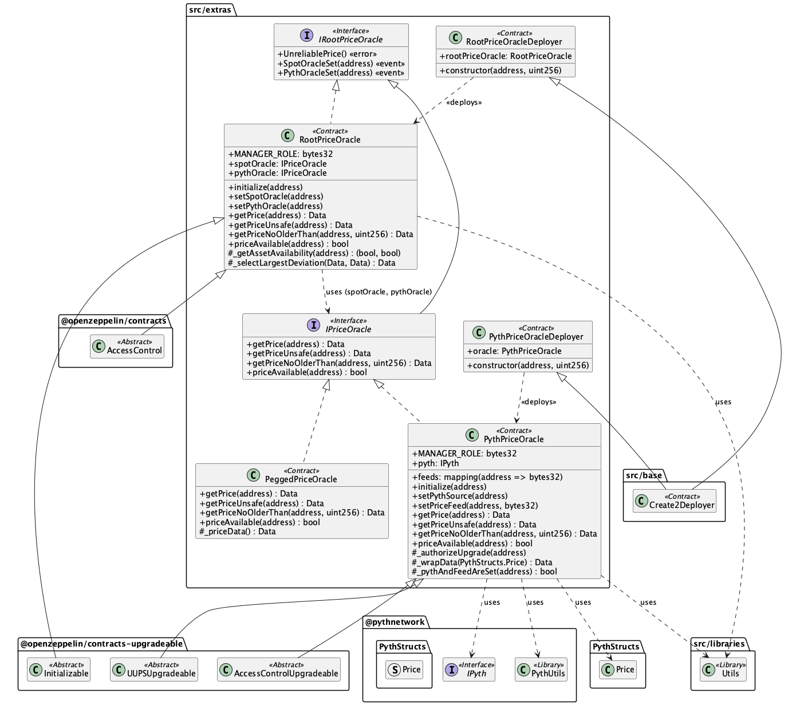

# src/extras

이 모듈은 주로 외부 시스템과의 연동, 특히 가격 오라클과 관련된 부가적인 컨트랙트들을 포함합니다.

## Contracts Overview

*   **IPriceOracle:** 가격 오라클의 표준 인터페이스입니다. 자산 가격과 마지막 업데이트 시간을 조회하는 함수(`getPrice`, `getPriceUnsafe`, `getPriceNoOlderThan`) 및 가격 유효성 확인 함수(`priceAvailable`)를 정의합니다.
*   **PeggedPriceOracle:** 특정 자산의 가격을 항상 1 USD (1e18 WAD)로 반환하는 간단한 오라클 구현체입니다. 주로 초기 배포 시점이나 특정 테스트 환경에서 사용될 수 있습니다.
*   **PythPriceOracle:** Pyth Network 오라클 시스템과 상호작용하여 가격 정보를 가져오는 구현체입니다. Pyth의 `IPyth` 인터페이스를 사용하여 특정 자산의 피드 ID(`feeds`)를 통해 가격을 조회합니다.
*   **PythPriceOracleDeployer:** `PythPriceOracle` 컨트랙트를 `CREATE2`를 사용하여 배포하는 헬퍼 컨트랙트입니다.
*   **IRootPriceOracle:** `IPriceOracle` 인터페이스를 확장하여 스팟(Spot) 오라클과 Pyth 오라클 설정을 위한 이벤트를 추가로 정의합니다. 신뢰할 수 없는 가격(Spot 오라클만 사용 가능한 경우)에 대한 에러도 정의합니다.
*   **RootPriceOracle:** 두 개의 다른 가격 오라클(`spotOracle`, `pythOracle`)을 결합하여 최종 가격을 결정하는 메타 오라클입니다. 일반적으로 하나는 온체인 DEX 기반의 스팟 가격 오라클, 다른 하나는 `PythPriceOracle`을 사용합니다. 두 오라클의 가격 중 1 USD에서 더 많이 벗어난(deviation이 큰) 가격을 최종 가격으로 선택하여 반환합니다. 이는 가격 조작 공격에 더 강한 저항성을 갖기 위함입니다. Spot 오라클만 사용 가능한 경우 가격을 신뢰할 수 없는 것으로 간주하고 revert시킵니다.
*   **RootPriceOracleDeployer:** `RootPriceOracle` 컨트랙트를 `CREATE2`를 사용하여 배포하는 헬퍼 컨트랙트입니다.

## Sequence Diagrams

아래 다이어그램들은 `extras` 모듈의 주요 컨트랙트들의 동작 방식을 보여줍니다.

### PeggedPriceOracle

`PeggedPriceOracle`이 가격을 조회하는 과정을 보여줍니다. 항상 고정된 가격(1 USD)을 반환합니다.

### PythPriceOracle

`PythPriceOracle`이 Pyth Network를 통해 특정 자산의 가격 피드를 조회하는 과정을 보여줍니다.

### RootPriceOracle

`RootPriceOracle`이 스팟 오라클과 Pyth 오라클로부터 가격을 받아 최종 가격을 결정하는 과정을 보여줍니다. 두 가격 중 USD에서 더 벗어난 값을 선택합니다.

 