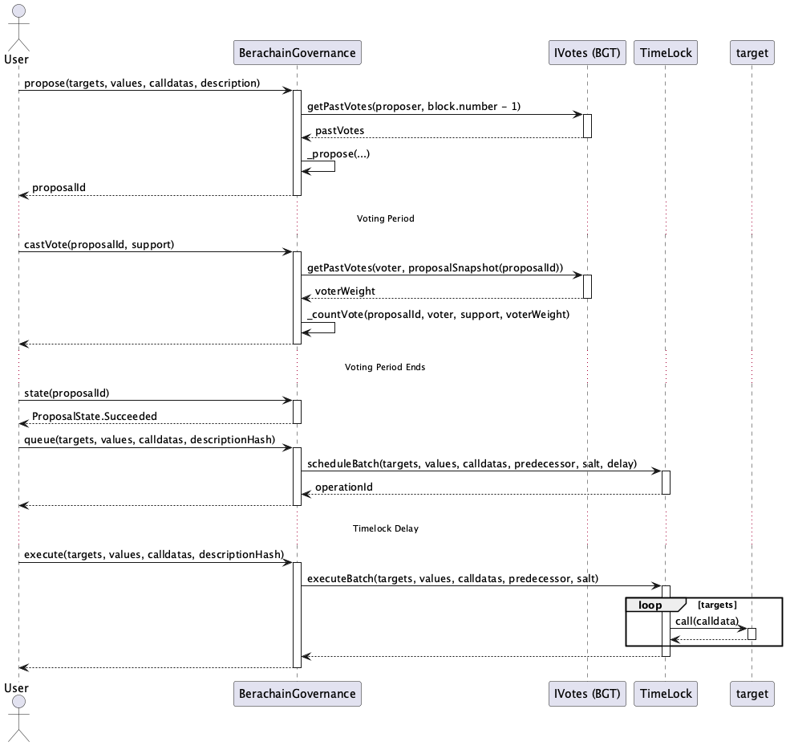
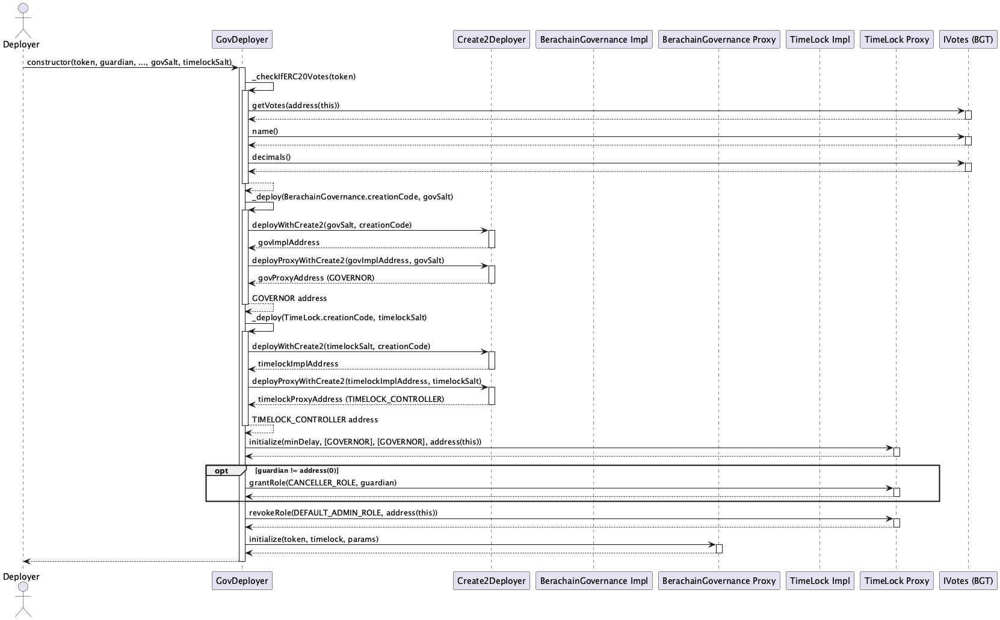
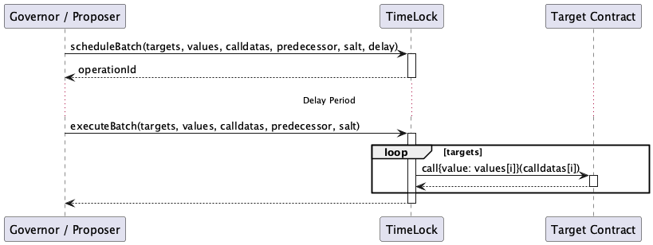

# src/gov

이 모듈은 Berachain의 거버넌스 시스템을 담당합니다.

## Contracts Overview

*   **BerachainGovernance:** 핵심 거버넌스 로직, 제안 관리, 투표 처리를 담당하며 OpenZeppelin Governor 프레임워크를 확장합니다.
*   **TimeLock:** 거버넌스 제안의 실행에 시간 지연을 적용하여 변경 사항 검토 및 대응 시간을 확보합니다. OpenZeppelin TimelockController를 기반으로 합니다.
*   **GovDeployer:** 거버넌스 시스템(`BerachainGovernance`, `TimeLock`)을 `CREATE2`를 사용하여 예측 가능한 주소에 안전하게 배포하는 헬퍼 컨트랙트입니다.

## BerachainGovernance Sequence

아래 다이어그램은 거버넌스 제안의 일반적인 라이프사이클(생성, 투표, 큐잉, 실행)을 보여줍니다.

## GovDeployer Sequence

이 다이어그램은 `GovDeployer`가 거버넌스 관련 컨트랙트들을 배포하고 초기화하는 과정을 보여줍니다.

## TimeLock Sequence

이 다이어그램은 `TimeLock` 컨트랙트를 통해 제안된 작업이 스케줄링되고 실행되는 과정을 보여줍니다.

 