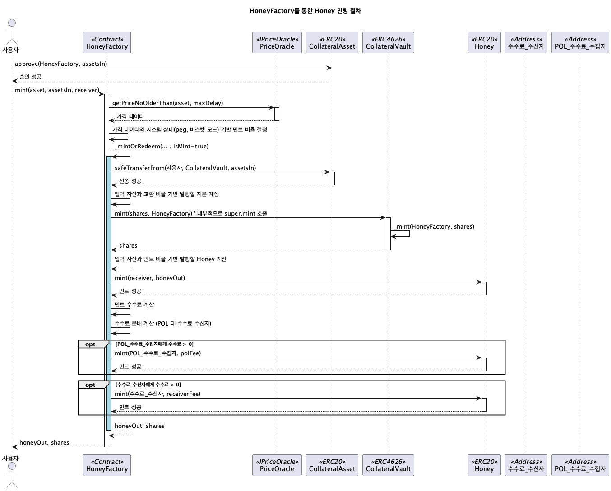
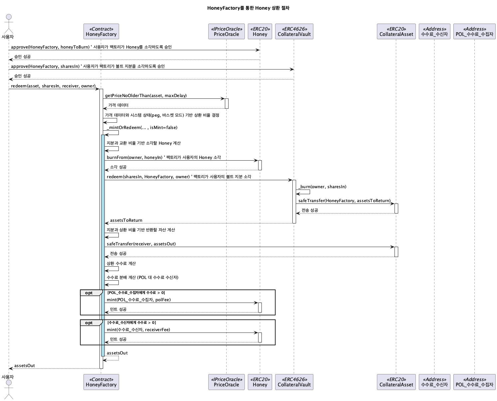

# src/honey

이 모듈은 Berachain의 네이티브 스테이블코인인 Honey($HONEY)의 발행, 상환 및 관련 시스템을 관리하는 컨트랙트들을 포함합니다.

## Contracts Overview

*   **Honey:** $HONEY ERC20 토큰 컨트랙트입니다. `HoneyFactory`에 의해서만 민팅 및 소각이 제어됩니다.
*   **HoneyFactory:** $HONEY의 핵심 로직을 담당합니다. 담보 자산을 예치하여 $HONEY를 발행하고, $HONEY를 소각하여 담보 자산을 상환하는 기능을 제공합니다.
    *   다양한 담보 자산을 지원하며, 각 자산별 민팅/상환 비율, 페깅 오프셋, 청산 비율 등을 관리합니다.
    *   담보 자산의 가격 및 페깅 상태에 따라 '바스켓 모드(Basket Mode)' 또는 '단일 자산 모드(Single Asset Mode)'로 동작할 수 있습니다.
    *   담보 자산의 가격 안정성을 위해 청산(Liquidation) 및 자본 재충전(Recapitalization) 메커니즘을 포함합니다.
*   **VaultAdmin:** `CollateralVault`의 생성, 관리 및 수수료 관리를 담당하는 추상 컨트랙트입니다. `HoneyFactory`가 이를 상속받아 사용합니다.
*   **CollateralVault:** 각 담보 자산별 ERC4626 표준 기반 볼트 컨트랙트입니다. 사용자가 직접 상호작용하는 대신 `HoneyFactory`를 통해 제어됩니다. 담보 자산을 예치하고 이에 상응하는 볼트 지분(Share) 토큰을 발행합니다.
*   **HoneyDeployer:** `Honey`, `HoneyFactory`, `HoneyFactoryReader` 컨트랙트를 `CREATE2`를 사용하여 배포하는 헬퍼 컨트랙트입니다.
*   **HoneyFactoryReader:** `HoneyFactory`의 상태를 조회하고 민팅/상환 시 예상 결과(Preview)를 계산하는 읽기 전용 컨트랙트입니다.

## HoneyFactory Mint Sequence ($HONEY 발행 흐름)

이 다이어그램은 사용자가 담보 자산을 `HoneyFactory`에 제공하여 $HONEY를 발행하는 과정을 보여줍니다. 팩토리의 상태(바스켓 모드 여부, 담보 페깅 상태)에 따라 단일 담보 또는 여러 담보(바스켓)가 사용될 수 있습니다. 담보 자산은 해당 `CollateralVault`에 예치되고, 계산된 $HONEY가 사용자에게 발행됩니다. 발행 과정에서 수수료가 징수되어 `feeReceiver`와 `polFeeCollector`에게 분배됩니다.

## HoneyFactory Redeem Sequence ($HONEY 상환 흐름)

이 다이어그램은 사용자가 $HONEY를 `HoneyFactory`에 제공하여 담보 자산을 상환받는 과정을 보여줍니다. 민팅과 마찬가지로 팩토리 상태에 따라 단일 또는 바스켓의 담보 자산이 반환될 수 있습니다. 사용자가 제공한 $HONEY는 소각되고, 해당 `CollateralVault`에서 담보 자산이 인출되어 사용자에게 전달됩니다. 상환 과정에서도 수수료가 징수됩니다.

## HoneyFactory 관리자 기능 흐름 (Admin/Manager)

이 다이어그램은 관리자(Admin) 또는 매니저(Manager) 역할을 가진 주소가 `HoneyFactory`의 함수를 호출하여 시스템 파라미터(민트/상환 비율, 수수료 비율 등)를 변경하거나, 특정 볼트를 일시정지하는 등의 관리 작업을 수행하는 과정을 보여줍니다. 각 작업은 역할 기반 접근 제어(`_checkRole`) 확인 후 실행됩니다.

## HoneyFactoryReader 데이터 조회 흐름

이 다이어그램은 외부 호출자가 `HoneyFactoryReader` 컨트랙트를 사용하여 $HONEY 민팅 또는 상환 시 예상되는 결과(예: 필요한 담보량, 받게 될 $HONEY 양)를 미리 계산하는 과정을 보여줍니다. `HoneyFactoryReader`는 `HoneyFactory`와 관련 `CollateralVault`에서 필요한 상태 정보(바스켓 모드, 가중치, 볼트 주소, 민트/상환 비율 등)를 읽어와 계산을 수행합니다.

 