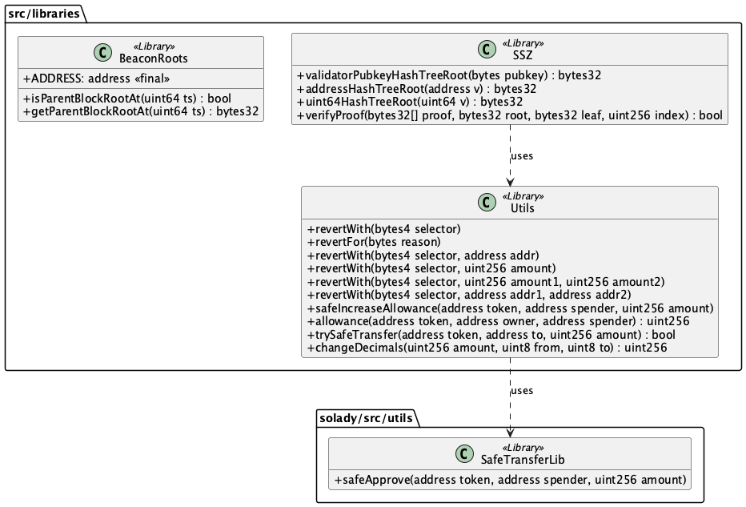
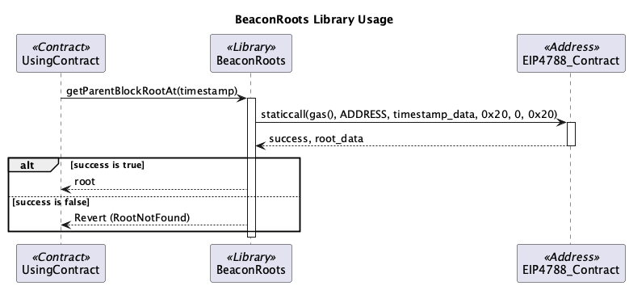
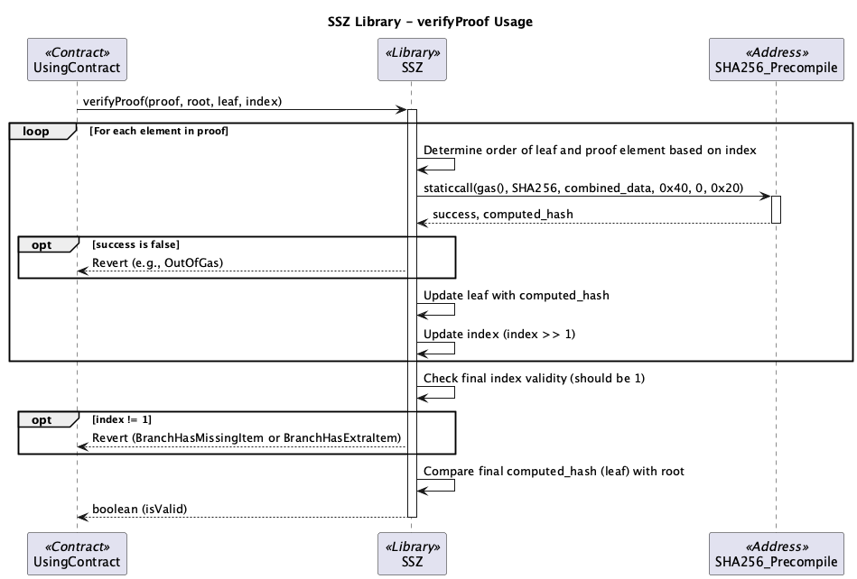
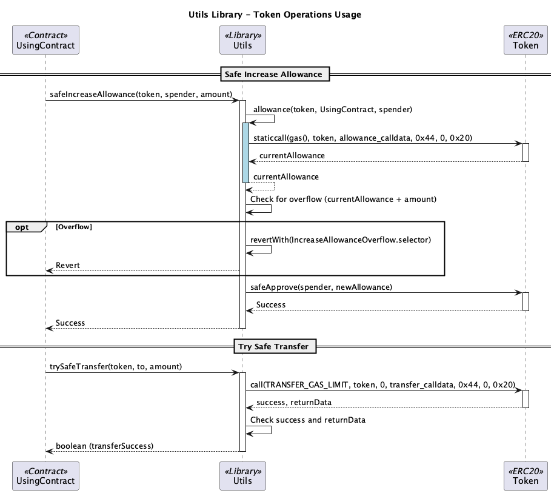

# src/libraries

이 모듈은 Berachain 컨트랙트 전반에서 사용되는 유틸리티 라이브러리들을 포함합니다.

## Libraries Overview

*   **BeaconRoots:** EIP-4788 표준을 사용하여 Beacon Chain의 블록 루트 정보에 접근하는 함수를 제공합니다. 특정 타임스탬프에 해당하는 블록 루트 존재 여부 확인 및 조회를 지원합니다.
*   **SSZ (Simple Serialize):** 이더리움 합의 레이어(Consensus Layer)에서 사용되는 SSZ 직렬화 형식 관련 함수를 제공합니다. 특정 데이터 타입(pubkey, address, uint64)의 해시 트리 루트 계산 및 머클 증명 검증(`verifyProof`) 기능을 포함합니다.
*   **Utils:** 컨트랙트 개발에 유용한 일반적인 유틸리티 함수들을 모아놓은 라이브러리입니다.
    *   Custom Error를 사용한 revert 함수 오버로딩 (`revertWith`, `revertFor`)
    *   안전한 ERC20 allowance 증가 (`safeIncreaseAllowance`)
    *   ERC20 allowance 조회 (`allowance`)
    *   실패 시 revert하지 않는 안전한 ERC20 전송 시도 (`trySafeTransfer`)
    *   토큰의 소수점 자릿수 변환 (`changeDecimals`) 

## Sequence Diagrams

아래 다이어그램들은 라이브러리의 일부 주요 기능들의 동작 방식을 보여줍니다.

### BeaconRoots

`BeaconRoots` 라이브러리를 사용하여 특정 타임스탬프에 해당하는 비콘 체인 블록 루트의 유효성을 검증하는 과정을 보여줍니다.

### SSZ (verifyProof)

`SSZ` 라이브러리의 `verifyProof` 함수를 사용하여 머클 증명을 검증하는 과정을 보여줍니다.

### Utils (Token Operations)

`Utils` 라이브러리에 포함된 토큰 관련 유틸리티 함수(예: `safeIncreaseAllowance`, `trySafeTransfer`)의 사용 예시를 보여줍니다.

 