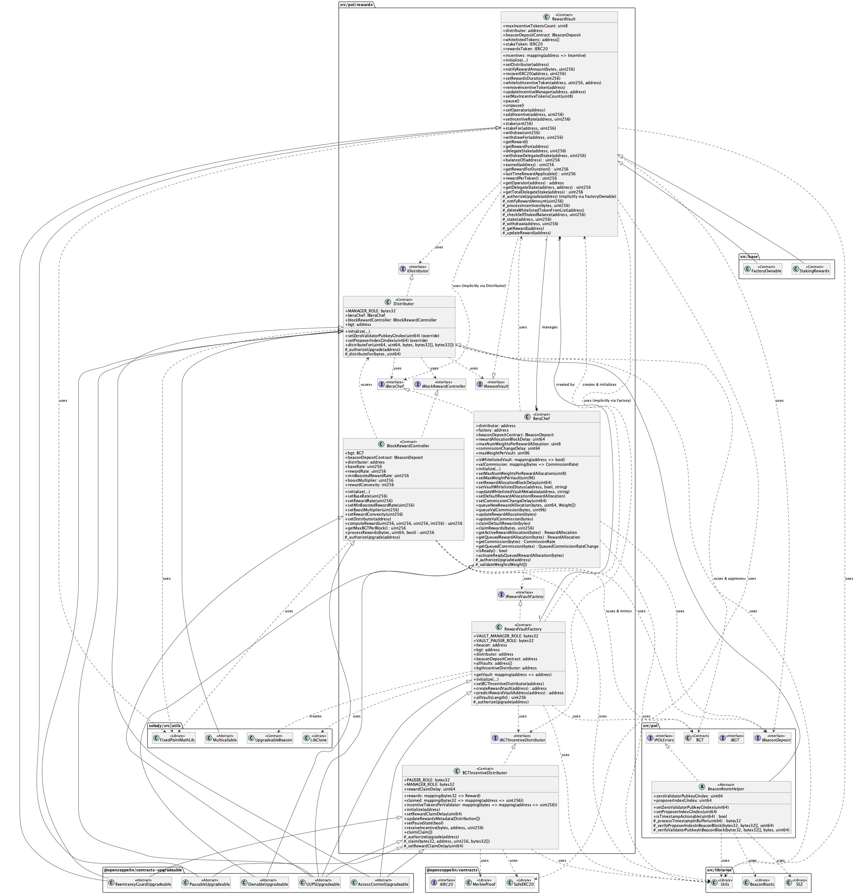

# src/pol (Proof of Liquidity)

이 모듈은 Berachain의 핵심인 Proof of Liquidity (PoL) 메커니즘과 관련된 컨트랙트들을 포함합니다. PoL은 네트워크 보안과 유동성 공급을 연결하는 시스템입니다.

## Contracts Overview

아래 다이어그램들은 POL 모듈의 주요 계약 그룹들을 보여줍니다.

### POL Core Contracts

BGT 토큰, 스테이킹, 수수료 처리, Beacon 체인 예치 등 PoL의 핵심 로직을 담당하는 계약들의 관계입니다.

### POL Rewards Contracts

블록 보상 계산 및 분배, 리워드 볼트 관리 등 PoL의 보상 시스템과 관련된 계약들의 관계입니다.

### POL Deployment

주요 PoL 계약들을 배포하는 Deployer 계약과 배포 대상 계약들과의 관계입니다.

### 주요 컨트랙트

*   **BGT (Bera Governance Token):** Berachain의 거버넌스 토큰입니다. 스테이킹, 부스팅, 거버넌스 투표 등에 사용됩니다.
*   **BeaconDeposit:** 검증자(Validator)의 BERA 예치 및 운영자(Operator) 관리를 담당합니다. 이더리움 Beacon Chain의 Deposit Contract와 유사한 역할을 합니다.
*   **Distributor:** 블록 보상(`BGT`)을 계산하고 검증자에게 분배하는 역할을 합니다. `BlockRewardController`로부터 보상률 정보를 받고, `BeraChef`로부터 검증자별 보상 분배 가중치를 받아 `RewardVault`로 보상을 전달합니다.
*   **BlockRewardController:** BGT의 발행률(민팅률)을 관리하고 계산합니다. 검증자의 부스팅 파워에 따라 BGT 발행량이 조절됩니다.
*   **BeraChef:** 검증자별 보상 분배 비율(`RewardAllocation`) 및 커미션(`CommissionRate`), 화이트리스트된 리워드 볼트(`RewardVault`)를 관리합니다. V0/V1과 유사하지만 일부 로직(e.g., `isReady`, `activateReadyQueuedRewardAllocation`)이 다릅니다.
*   **RewardVaultFactory:** `RewardVault` 인스턴스를 생성하고 관리하는 팩토리 컨트랙트입니다.
*   **RewardVault:** 특정 스테이킹 토큰에 대한 BGT 보상 및 외부 인센티브 토큰의 스테이킹과 분배를 담당합니다.
*   **BGTStaker:** 사용자가 BGT를 실제로 전송하지 않고 스테이킹하여 앱(dApp) 수수료 보상을 받을 수 있도록 합니다. `FeeCollector`로부터 보상을 받습니다.
*   **FeeCollector:** Berachain dApp들로부터 수수료를 수집하고, 이를 경매 또는 특정 메커니즘을 통해 `payoutToken`으로 변환하여 `BGTStaker`에게 전달합니다.
*   **BGTIncentiveDistributor:** `RewardVault`를 통해 BGT 부스터(Booster)에게 분배될 인센티브 토큰을 관리하고, 머클 루트 기반으로 클레임을 처리합니다.
*   **POLDeployer, BGTFeeDeployer:** 관련 PoL 컨트랙트들을 `CREATE2`를 사용하여 배포하는 헬퍼 컨트랙트입니다.
*   **BeaconRootsHelper:** EIP-4788 Beacon Roots 컨트랙트 정보를 활용하여 블록 타임스탬프 처리 및 검증자 증명(Proof) 검증을 돕는 추상 컨트랙트입니다.

## Distributor Sequence (보상 분배 흐름)

이 다이어그램은 `Distributor`가 Beacon Chain 정보를 검증하고, `BlockRewardController`로부터 BGT 보상을 계산/민팅 받아 `BeraChef` 설정에 따라 각 `RewardVault`로 분배하는 전체 과정을 보여줍니다.

## BGT Sequence (부스팅 및 스테이킹 흐름)

이 다이어그램은 사용자가 BGT를 사용하여 검증자 보상을 부스팅하고, BGT 자체를 `BGTStaker`에 스테이킹하는 과정, 그리고 `BlockRewardController`에 의해 BGT가 민팅되는 과정을 보여줍니다.

## FeeCollector Sequence (수수료 클레임 흐름)

이 다이어그램은 외부 클레이머(Claimer)가 `FeeCollector`에 쌓인 앱 수수료를 `payoutToken`으로 지불하고 가져가는 과정을 보여줍니다. 이 과정에서 `payoutToken`은 `BGTStaker`로 전달됩니다.

## BGTIncentiveDistributor Sequence (인센티브 분배/클레임)

이 다이어그램은 `RewardVault`로부터 BGT 부스터 인센티브를 받고, 머클 루트를 업데이트하며, 사용자가 머클 증명을 통해 인센티브를 클레임하는 과정을 보여줍니다.

## 기타 주요 컨트랙트 시퀀스

*   **BeraChef / RewardVault / RewardVaultFactory:** V0/V1 버전과 유사한 흐름을 가집니다. 자세한 내용은 해당 모듈 문서를 참조하십시오.
    *   [V1 Contracts](V1_Contracts.md)
    *   [v0 Contracts](v0_Contracts.md)
*   **BlockRewardController:** `Distributor` 시퀀스 다이어그램 내 `processRewards` 호출 부분을 참조하십시오.
*   **BGTStaker:** `BGT` 및 `FeeCollector` 시퀀스 다이어그램 내 관련 상호작용을 참조하십시오.
*   **BeaconDeposit:** 일반적인 예치 및 운영자 변경 흐름을 따릅니다. 