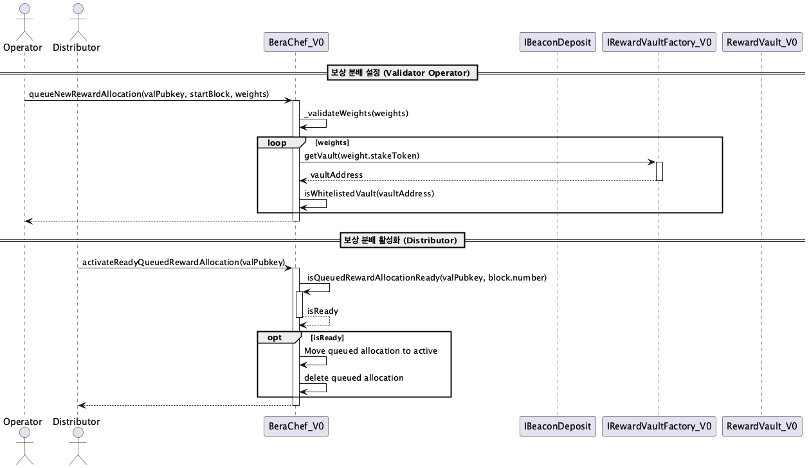

# src/v0_Contracts

이 모듈은 Berachain의 가장 초기 버전(V0) 보상 시스템 관련 컨트랙트들을 포함합니다. V1과 유사하지만 일부 기능 및 구현 방식에 차이가 있습니다.

## Contracts Overview

*   **BeraChef_V0:** V1과 유사하게 검증자별 보상 분배 비율 및 화이트리스트된 리워드 볼트를 관리합니다. V1과 달리 보상 분배 활성화(`activateReadyQueuedRewardAllocation`) 로직이 존재합니다.
*   **RewardVaultFactory_V0:** `RewardVault_V0` 인스턴스를 생성하고 관리하는 팩토리 컨트랙트입니다. Beacon Proxy 패턴을 사용하여 볼트를 배포합니다.
*   **RewardVault_V0:** V1과 유사하게 특정 스테이킹 토큰에 대한 BGT 보상 및 추가 인센티브 토큰의 스테이킹과 분배를 담당합니다. `RewardVaultFactory_V0`에 의해 생성 및 관리됩니다.

## BeraChef_V0 Sequence

아래 다이어그램은 `BeraChef_V0`을 통해 검증자가 보상 분배 설정을 큐에 넣고, 이후 Distributor가 해당 설정을 활성화하는 과정을 보여줍니다.

## RewardVaultFactory_V0 Sequence

이 다이어그램은 `RewardVaultFactory_V0`가 새로운 `RewardVault_V0` 인스턴스(Proxy)를 생성하고 초기화하는 과정을 보여줍니다.

## RewardVault_V0 Sequence

`RewardVault_V0`의 주요 동작(스테이킹, 보상 받기, 인센티브 추가 등)은 `RewardVault_V1`과 거의 동일합니다. 자세한 흐름은 아래 V1 시퀀스 다이어그램을 참조하십시오.

[RewardVault_V1 Sequence Diagram](diag-images/V1_Contracts/RewardVault_V1_Sequence.png) 